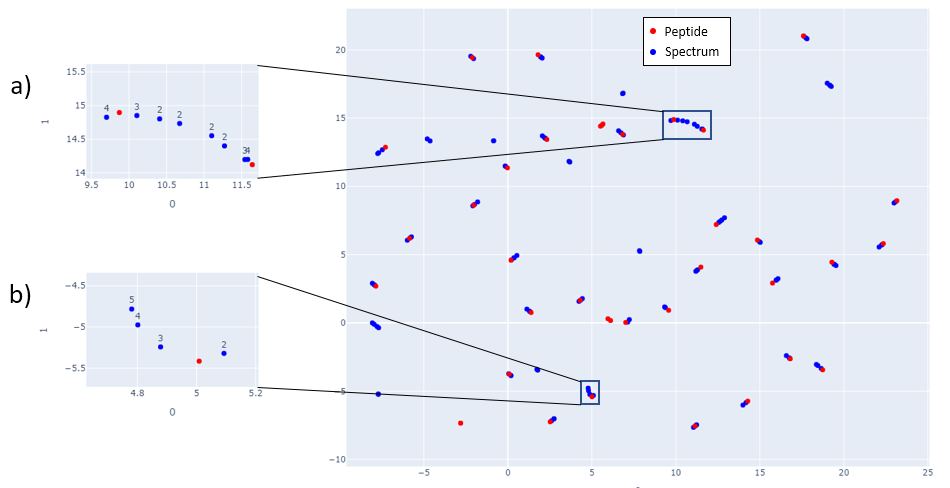
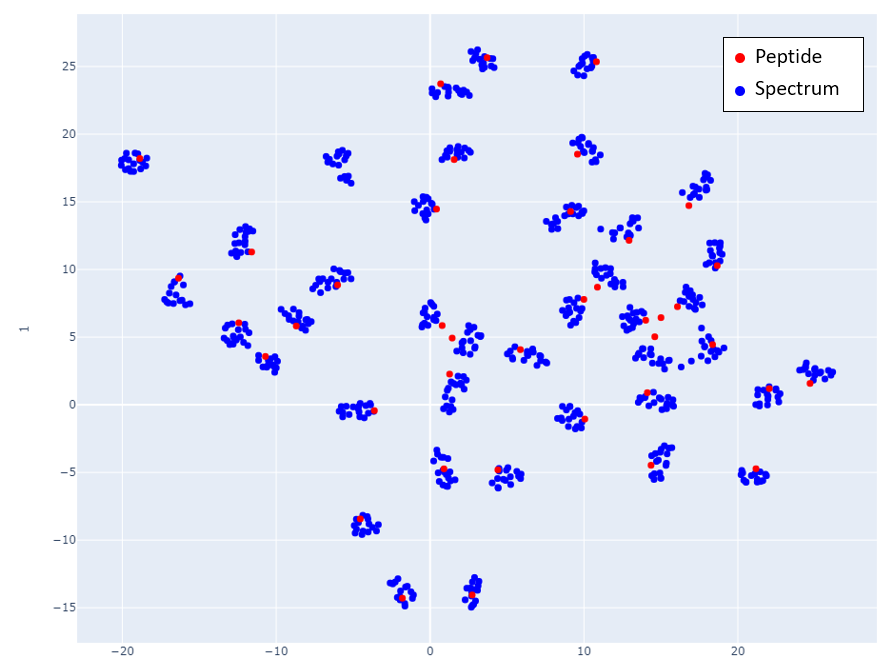
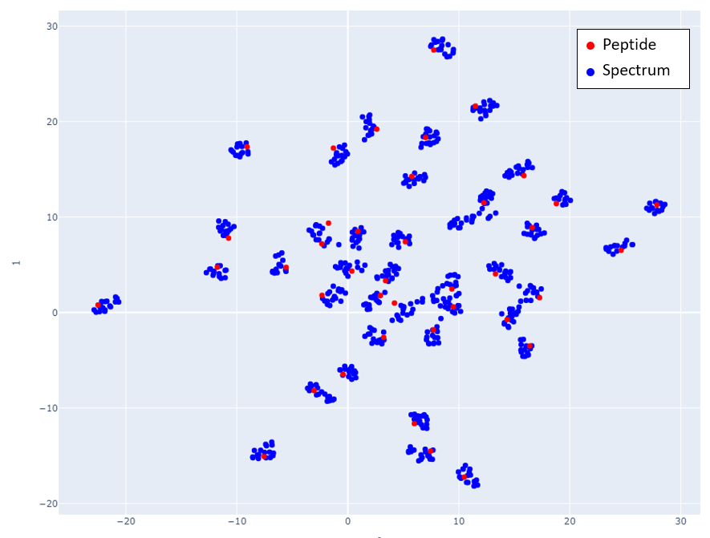
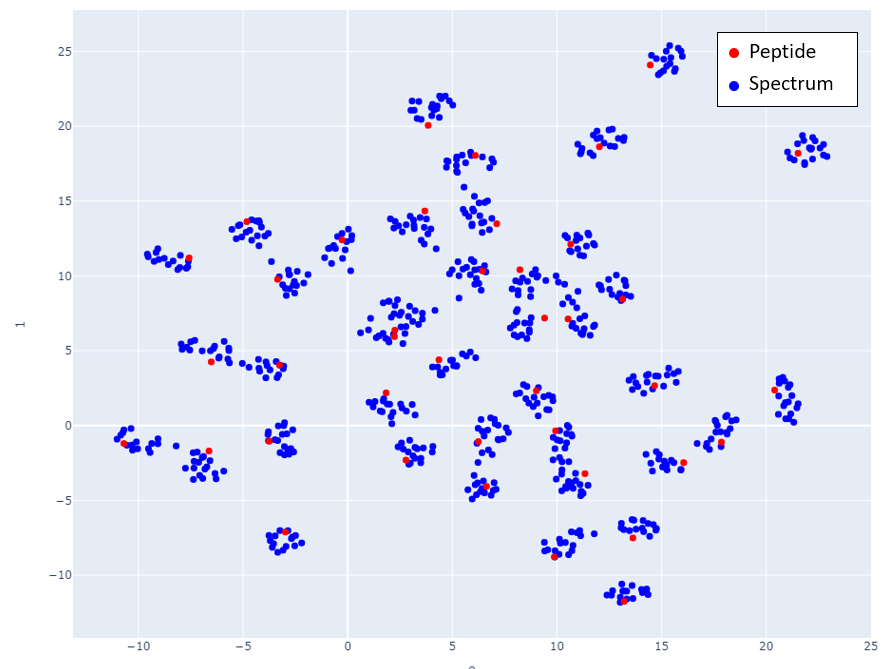

## Performing Database Search using SpeCollate

SpeCollate is available as a standalone executable that can be downloaded and run on a Linux server with a Cuda-enabled GPU.

Two different executables are included in the downloadable specollate.tar.gz file; 1) specollate_train for retraining a model and 2) specollate_search for performing database search using a trained model. A pre-trained model is provided within the download file.

The below sections separately explain the setup for training and search operation. You can skip the training section if you only intend to use SpeCollate for database search.

### Prerequisites

- A Computer with Ubuntu 16.04 (or later) or CentOS 8.1 (or later).
- At least 120GBs of system memory and 10 CPU cores.
- Cuda enabled GPU with at least 12 GBs of memory. Cuda Toolkit 10.0 (or later).
- OpenMS tool for creating custom peptide database. (Optional)
- Crux for FDR analysis using its percolator option.


### Search

1. Same as step 1 in the **Training** section.
2. Download one of the [mgf files](https://drive.google.com/drive/folders/1dvvbYjtz9PrFcMzB-VvtGbrWNX-hl6Io?usp=sharing). Or you can use your own spectra files in mgf format.
3. Download the [human peptide database](https://drive.google.com/uc?export=download&id=1pOBYkCFl66Yk1DjSIw6l9RRi7f6iSXSf). You can provide your own peptide database file created using the Digestor tool provided by [OpenMS](https://www.openms.de/download/openms-binaries/).
4. Set the following parameters in the [search] section of the `config.ini` file:
    - `model_name`: Name of the model to be used. The model should be in the `/models` directory.
    - `mgf_dir`: Absolute path to the directory containing mgf files to be searched.
    - `prep_dir`: Absolute path to the directory where preprocessed mgf files will be saved.
    - `pep_dir`: Absolute path to the directory containing peptide database.
    - `out_pin_dir`: Absolute path to a directory where percolator pin files will be saved. The directory must exist; otherwise, the process will exit with an error.
    - Set database search parameters e.g. `precursor_mass_tolerance` etc.

5. Execute the specollate_search file:  
`./specollate_search`  
If you want to use the preprocessed spectra from a previous run, use the `-p False` flag:  
`./specollate_search -p False`

6. Once the search is complete; you can analyze the percolator files using the crux percolator tool:
```shell
cd <out_pin_dir>
crux percolator target.pin decoy.pin --list-of-files T --overwrite T
```

### Visualizing Embeddings

Here we will show the UMAP projections of the embedded spectra and peptides generated by the trained network.

In Fig 1, mappings of spectra and peptide embeddings from NIST Library Human-HCD-Phospho are shown at mass 2000 Da. Peptides are shown in red points, and the clustering of the blue points around the peptide (red point) represents the spectra belonging to that peptide. 

  
*Fig 1: Spectra and Peptide projections of the embedded spectra and peptides. Embeddings are generated from 40 peptides and their corresponding spectra selected in increasing precursor mass value starting at 2000 Da. Adjacent mass values are chosen to show that the network is able to distinguish peptides and spectra that are close in mass. Subfigures a) and b) show how spectra with different charges map close to the peptides. Although different charge spectra are mapped close to the peptide, they still tend to be relatively farther from other charges. In subfigure a) spectra with charge 4 are closest to the peptide while in subfigure b) spectra with lower charge are closest to the peptide.*

<br/>

Figs 2-6 show the mappings for Proteome Tools library data. Peptides with more than 15 corresponding spectra of different precursor charge are selected.

    
*Fig 2: Proteome Tools spectra and peptides selected at 1500 Da.*
 
 <br/>
  
  
*Fig 3: Zoom in of Fig 2.*
  
 <br/>
  
  
*Fig 4: Proteome Tools spectra and peptides selected at 1700 Da.*
  
 <br/>
  
  
*Fig 5: Proteome Tools spectra and peptides selected at 2300 Da.*
  
 <br/>
  
  
*Fig 6: Proteome Tools spectra and peptides selected at 2500 Da.*

